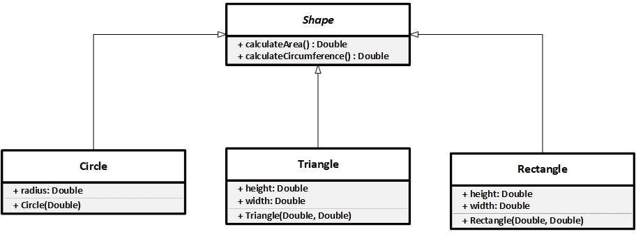

# Warmup_Week02_Day04 🔥
---
## You will be completing code for a Shape Abstract Class and 3 subclasses, Triangle, Rectangle, and Circle. Shape defines two abstract methods calculateArea() and calculateCircumference(). Both return doubles representing the area and circumference of the shapes respectively.
## For each shape you will have to create the necessary values need to calculate each of these values. You will also need to create constructors for each class, and the instructions for those will be included with each class.
## Provided below is a UML diagram that gives a visual representation of this warm-up.




## You can now test the code written in those classes in main function. And make sure the area and circumference are being returned correctly and display it.

## Equations
- Triangle: `area = 0.5 × base × height`
- Rectangle: `area = height * width` - `circumference = 2 * height + 2 * width`
- Circle: `area = 3.14 * radius * radius` - `circumference = 2 * 3.14 * radius`

# Output
```
Triangle shape:
Area = 7.5 cm
Circumference = 7.5 cm
------------------------------------
Rectangle shape:
Area = 50 cm
Circumference = 30 cm
------------------------------------
Circle shape:
Area = 43.96 cm 
Circumference = 153.86 cm

```

